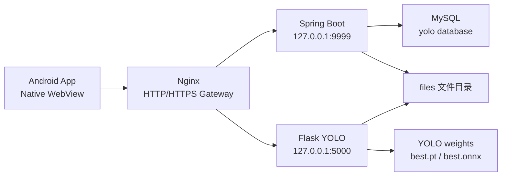
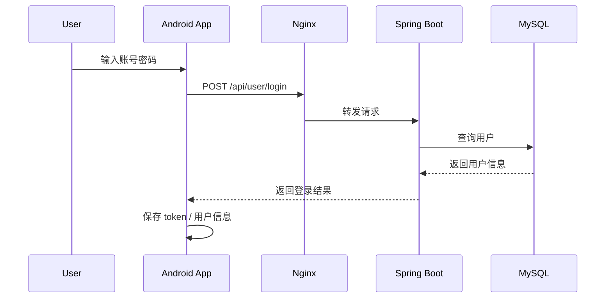
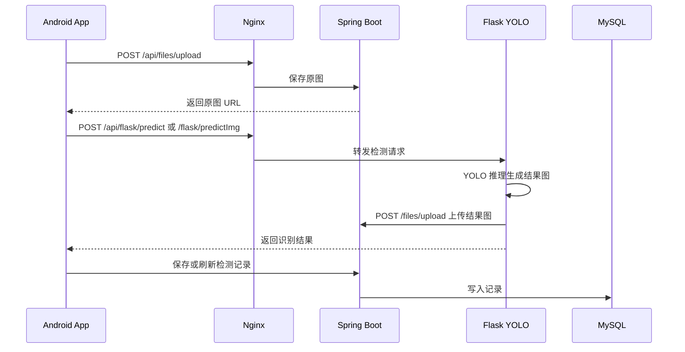

# 药品检测系统 Android App 设计文档

## 1. 项目概述

药品检测系统 Android App 面向移动端使用场景，用户可以在手机上登录系统，上传药品图片或视频，调用云端 YOLO 模型完成识别，并查看检测结果与历史记录。

系统采用前后端分离与云端推理架构：

- Android App：负责 WebView 容器、文件选择、相机/媒体权限、页面展示。
- Spring Boot：负责用户、文件、记录、业务接口。
- Flask：负责 YOLO 模型加载、图片检测、视频检测、摄像头检测和 Socket 推送。
- MySQL：保存用户、图片记录、视频记录、摄像头记录等数据。
- Nginx：统一 HTTPS 入口和反向代理。

## 2. 总体架构



对外只暴露：

```text
80   HTTP，跳转 HTTPS
443  HTTPS，App 调用入口
```

服务器内部端口：

```text
9999 Spring Boot
5000 Flask
3306 MySQL，仅本机访问
```

## 3. 模块设计

### 3.1 Android App 模块

职责：

- 登录和注册。
- 图片上传与检测。
- 批量图片上传与检测。
- 视频上传与检测。
- 摄像头检测结果展示。
- 图片、视频、摄像头历史记录查看。
- 用户信息维护。

实现方式：

- 复用 `MedicineDetection_vue`。
- 使用 `MedicineDetection_mobile_app/android_webview` 原生 WebView 工程生成 APK。
- App 加载云服务器上的 Vue 页面。
- 所有后端请求通过云服务器统一入口访问，正式发布建议使用 HTTPS 域名。

### 3.2 Spring Boot 业务模块

当前主要控制器：

```text
/user           用户登录、注册、查询、更新
/files          文件上传、文件访问、文件夹上传
/imgRecords     图片检测记录
/videoRecords   视频检测记录
/cameraRecords  摄像头检测记录
/flask          Spring Boot 中转或文件名查询相关接口
```

职责：

- 管理用户和业务数据。
- 统一接收文件上传。
- 提供文件访问 URL。
- 保存识别记录。
- 查询历史记录。

### 3.3 Flask YOLO 模块

当前主要接口：

```text
/predictImg
/predictImgBatch
/predictVideo
/predictCamera
/socket.io
```

职责：

- 加载 YOLO 权重。
- 对图片、批量图片、视频帧进行推理。
- 生成结果图片或结果视频。
- 将结果文件上传到 Spring Boot 文件接口。
- 对摄像头或长任务推送进度。

### 3.4 MySQL 数据库模块

职责：

- 保存用户信息。
- 保存图片检测记录。
- 保存视频检测记录。
- 保存摄像头检测记录。
- 关联上传文件和识别结果。

数据库初始化脚本：

```text
yoloai.sql
```

## 4. 请求路径设计

App 不直接访问 `:9999` 或 `:5000`，统一访问域名。

```text
https://medicine.example.com/api/user/login
https://medicine.example.com/api/files/upload
https://medicine.example.com/api/imgRecords
https://medicine.example.com/flask/predictImg
https://medicine.example.com/flask/predictVideo
https://medicine.example.com/socket.io/
```

Nginx 转发规则：

```text
/api/      -> http://127.0.0.1:9999/
/flask/    -> http://127.0.0.1:5000/
/socket.io -> http://127.0.0.1:5000/socket.io
```

## 5. 核心业务流程

### 5.1 登录流程



### 5.2 图片检测流程



### 5.3 视频检测流程

```text
App 上传视频 -> Spring Boot 保存视频 -> App 调 Flask 视频检测接口
-> Flask 逐帧推理 -> 生成 output.mp4 -> 上传到 Spring Boot
-> 返回结果视频 URL -> App 播放和保存记录
```

## 6. 文件存储设计

建议服务器文件目录：

```text
/opt/medicine-detection/
  app/
    MedicineDetection_springboot/
    MedicineDetection_flask/
    MedicineDetection_vue/
  data/
    files/
    logs/
    backups/
```

Spring Boot 上传目录建议固定到：

```text
/opt/medicine-detection/data/files
```

避免使用相对目录导致 systemd 启动后文件写入位置变化。

## 7. 安全设计

基础安全策略：

- App 只访问 HTTPS 域名。
- 阿里云安全组只开放 22、80、443。
- 9999、5000、3306 不对公网开放。
- MySQL 只监听本机或内网。
- 数据库密码不提交到前端。
- Flask 和 Spring Boot 的上传接口限制文件类型与大小。
- Nginx 设置上传大小限制，当前视频上传建议 `500m`。

后续可增强：

- 登录接口增加 token 过期时间。
- 上传文件做后缀和 MIME 校验。
- 管理员接口增加权限判断。
- Nginx 增加访问日志和错误日志切分。
- 数据库定时备份。

## 8. 性能设计

阿里云 4 核 8G 适合毕业设计演示和轻量使用。

建议：

- Flask 推理进程先设置 1 个主进程，避免多个进程重复加载 YOLO 模型占用内存。
- 视频检测属于重任务，前端需要显示加载状态。
- 上传视频大小限制建议控制在 500MB 以下。
- YOLO 权重优先使用较小模型，例如 `best.pt` 或导出的 `best.onnx`。
- 如果 CPU 推理慢，答辩时优先演示图片检测和短视频检测。

## 9. 可维护性设计

所有环境相关配置统一放在环境变量或配置文件中：

```text
VITE_API_DOMAIN
VITE_SPRING_API
VITE_FLASK_API
VITE_SOCKET_URL
SPRING_DATASOURCE_URL
SPRING_DATASOURCE_USERNAME
SPRING_DATASOURCE_PASSWORD
MEDICINE_FILE_BASE_DIR
```

不要在页面组件里硬编码：

```text
127.0.0.1
localhost
服务器公网 IP
数据库密码
API Key
```

## 10. 交付物设计

最终交付建议包括：

- Android APK。
- 云服务器部署截图。
- App 登录截图。
- 图片检测截图。
- 视频检测截图。
- 历史记录截图。
- 系统架构图。
- 数据库表说明。
- 开发文档、设计文档、部署文档。
